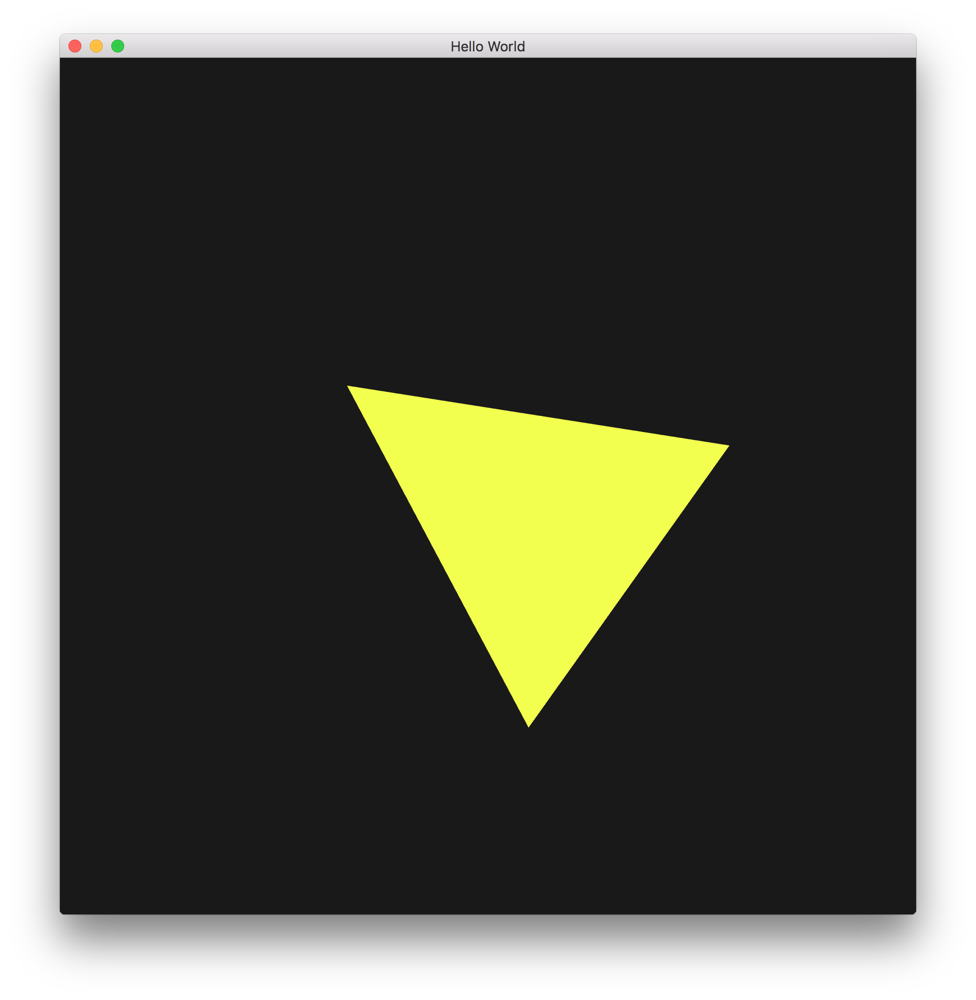
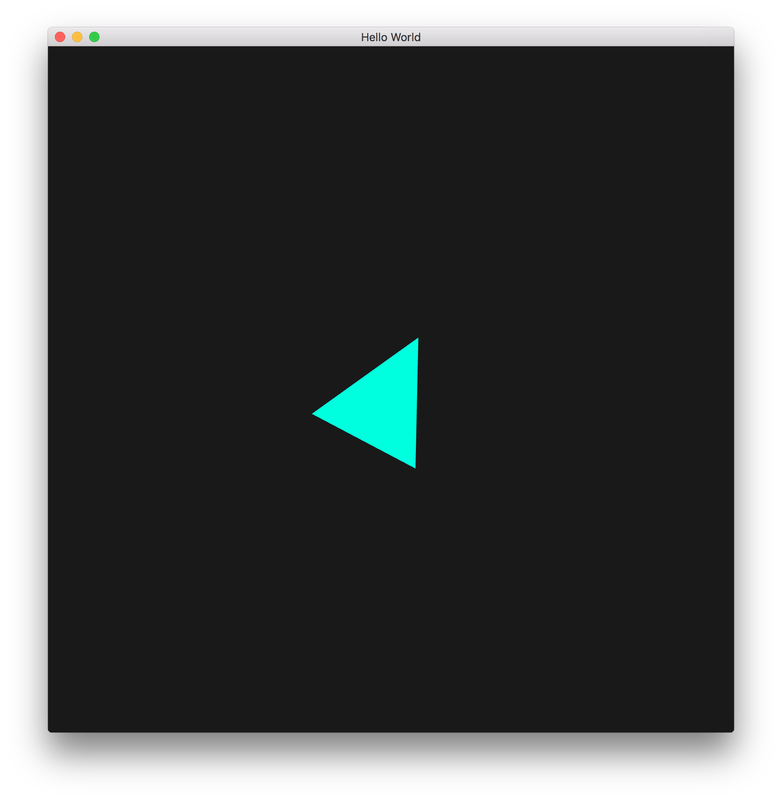

# clion-modern-opengl
CLion starting point (boilerplate) for creating modern OpenGL applications in C++ in MacOS, Windows, and Linux.

The current scene contains a spinning triangle whose colour varies over time. You can zoom in and out of the scene by left-clicking and dragging on the window.

Plumbing includes use of a VAO, a VBO, GLFW callbacks, uniform variables, and a basic shader program for you to use as a starting point in your projects.

## Screenshots




## Instructions

Clion uses CMake which should simplify using GLFW3, GLEW, and GLM.

⚠️ Be sure to set the correct working directory for the current build configuration in CLion.

### MacOS

Brew has up-to-date versions of all three dependencies.

```
brew update
brew install glfw glew glm
```

### Windows

(coming soon!)

### Linux

(coming soon!)
